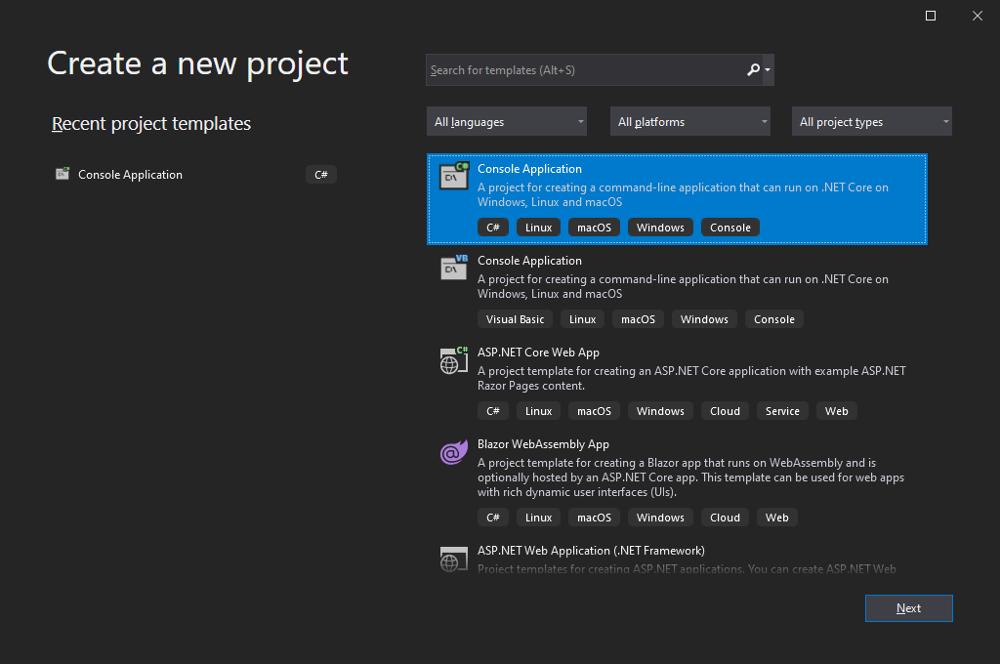
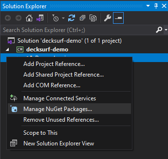
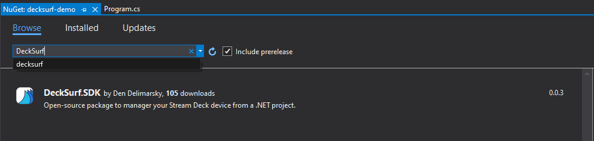
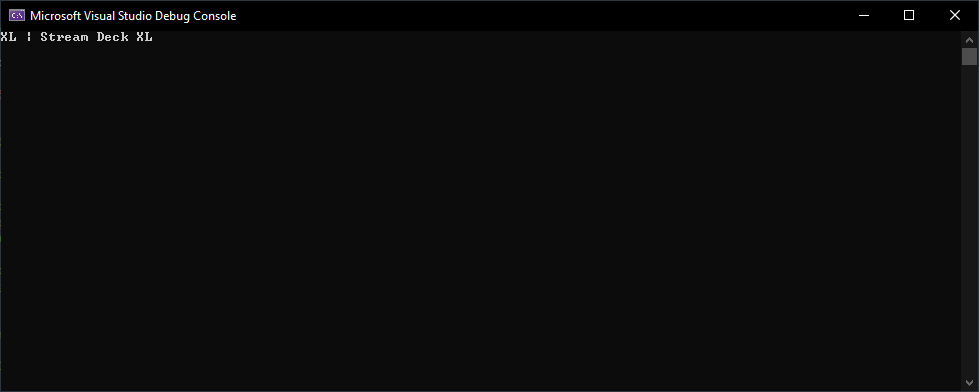
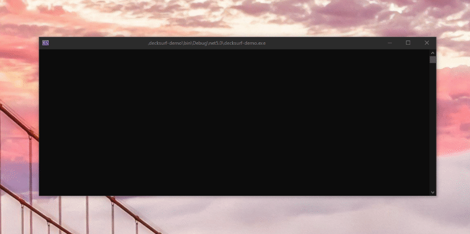

# Getting Started with DeckSurf

This article will tell you how to go from zero to comfortable with DeckSurf.

The idea behind the SDK is to give you direct access to a Stream Deck device that is connected to your computer. If you want to learn more about the inner workings of the device itself, refer to [a blog post I put together](https://den.dev/blog/reverse-engineering-stream-deck/) that documents how I reverse engineered the USB protocol.

## Installing the package

To get started, start a new .NET console application project in Visual Studio. You can bootstrap a project through other means - the internals will be the same.

>[!NOTE]
>The SDK is designed to work with Windows only at this time. Future releases might be updated to support other platforms.



Once the project is bootstrapped, you can add a new package reference by right-clicking on the project in the **Solution Explorer** and selecting the option to **Manage NuGet Packages...**



Search for "DeckSurf" and install the package:



## First sample code

Once the package is installed, you can start using the SDK to access the Stream Deck device. As a starting point, let's take a look at how to listen to button presses.

To do that, start by adding a new `using` statement to your `Program.cs` file:

```csharp
using DeckSurf.SDK.Core;
```

The [DeckSurf.SDK.Core](https://docs.deck.surf/api/DeckSurf.SDK.Core.html) is responsible for managing all connected devices. We will use it to list Stream Deck devices connected to the machine:

```csharp
var devices =  DeviceManager.GetDeviceList();

foreach(var device in devices)
{
    Console.WriteLine($"{device.Model} | {device.Name}");
}
```

If the device is successfully identified, you should see the device model and full name displayed in the console.



With a device connected, you can now set up the application to listen to individual keys. To do that, you will need to make sure that you add a [`ManualResetEvent`](https://docs.microsoft.com/dotnet/api/system.threading.manualresetevent?view=net-5.0), which will act as a semaphore, that will prevent your application from closing once it finishes device initialization (_console applications behave this way_).

To do that, add these two lines in your `Main` function:

```csharp
var exitSignal = new ManualResetEvent(false);

// Your code will go here.

exitSignal.WaitOne();
```

This will also require that you add a reference to [`System.Threading`](https://docs.microsoft.com/dotnet/api/system.threading?view=net-5.0) in your `using` statement section:

```csharp
using System.Threading;
```

To listen to device key presses, you will need to:

1. Get a list of devices.
1. Get an instance of the _specific_ device you want to listen to.
1. Create an event handler.
1. Initialize the device (_opens the stream to the device_).

In C# code form, that will look like this:

```csharp
var devices = DeviceManager.GetDeviceList();
var device = ((List<ConnectedDevice>)devices)[0];
device.OnButtonPress += (s, e) =>
{
    Console.WriteLine(e.Id);
};
device.StartListening();
```

To use the [`ConnectedDevice`](https://docs.deck.surf/api/DeckSurf.SDK.Models/DeckSurf.SDK.Models.ConnectedDevice.html) class, you need to add a reference to [`DeckSurf.SDK.Models`](https://docs.deck.surf/api/DeckSurf.SDK.Models.html):

```csharp
using DeckSurf.SDK.Models;
```

>[!NOTE]
>Keep in mind that the snippet above is for demo purposes only - I am making a _very_ risky assumption, and that is taking the first device in the list of returned devices. It's entirely possible that there are zero devices connected. You need to make sure that you check for that.

Once you build and run the application, for every button press you will see the button numeric ID shown in the terminal:



When the key is lifted, the ID shown is -1.

You can also access various metadata about the button action in the event handler. For example, instead of inlining the event, you may want to define a custom event handler, and have it print the button actions:

```csharp
private static void Device_OnButtonPress(object source, ButtonPressEventArgs e)
{
    Console.WriteLine($"Button with ID {e.Id} was pressed. It's identified as {e.ButtonKind}. Event is {e.EventKind}. If this is a touch screen, coordinates are {e.TapCoordinates.X} and {e.TapCoordinates.Y}. Is knob rotated: {e.IsKnobRotating}. Rotation direction: {e.KnobRotationDirection}.");
}
```

If you'd like to set an image for a device button, you can use the [`SetKey`](xref:DeckSurf.SDK.Models.ConnectedDevice.SetKey(System.Int32,System.Byte[])) function.

Prior to that, however, you should resize the image to fit the device requirements with the help of the [`ResizeImage`](xref:DeckSurf.SDK.Util.ImageHelpers.ResizeImage(System.Byte[],System.Int32,System.Int32,System.Boolean)) helper.

```csharp
var keyImage = ImageHelpers.ResizeImage(testImage, device.ButtonResolution, device.ButtonResolution, device.IsButtonImageFlipRequired);
device.SetKey(1, keyImage);
```

Congratulations - you just built your first DeckSurf-powered application!
