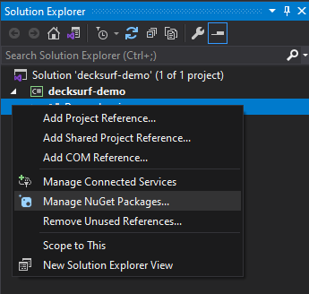
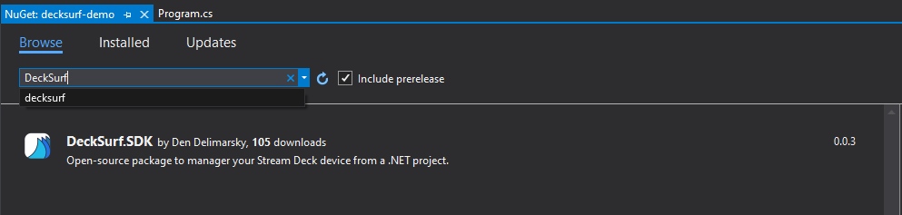
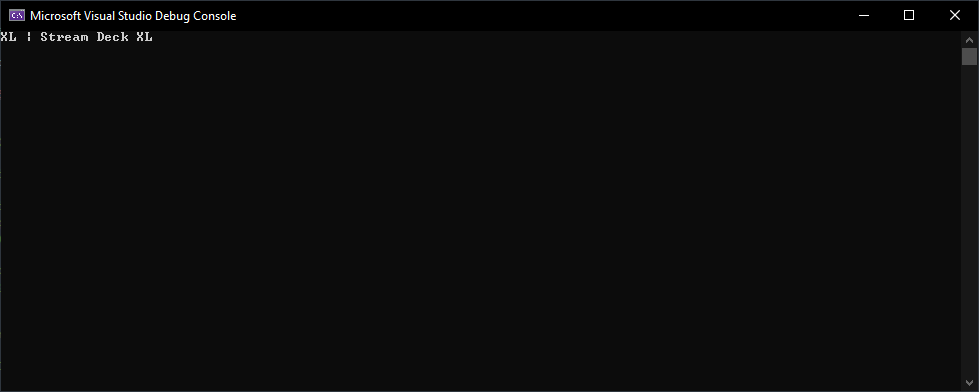

# Getting Started with DeckSurf

This article will tell you how to go from zero to comfortable with DeckSurf. The idea behind the SDK is to give you direct access to a Stream Deck device that is connected to your computer. If you want to learn more about the inner working of the tooling, refer to [a blog post I put together](https://den.dev/blog/reverse-engineering-stream-deck/) that documents how I reverse engineered the USB protocol.

## Installing the package

To get started, start a new .NET 5.0 console application project in Visual Studio. You can bootstrap a project through other means - the internals will be the same.

>[!NOTE]
>The SDK is designed to work with Windows only at this time. Future releases might be updated to support other platforms.


Once the project is bootstrapped, you can add a new package reference by right-clicking on the project in the **Solution Explorer** and selecting the option to **Manage NuGet Packages...**



Search for "DeckSurf" and install the package:



## First sample code

Once the package is installed, you can start using the SDK to access the Stream Deck device. As a starting point, let's take a look at how to listen to button presses.

To do that, start by adding a new `using` statement to your `Program.cs` file:

```csharp
using DeckSurf.SDK.Core;
```

The [DeckSurf.SDK.Core](https://docs.deck.surf/api/DeckSurf.SDK.Core.html) is responsible for managing all connected devices. We will use it to list Stream Deck devices connected to the machine:

```csharp
var devices =  DeviceManager.GetDeviceList();

foreach(var device in devices)
{
    Console.WriteLine($"{device.Model} | {device.Name}");
}
```

If the device is successfully identified, you should see the device model and full name displayed in the console.



With a device connected, you can now set up the application to listen to individual keys. To do that, you will need to make sure that you add a [`ManualResetEvent`](https://docs.microsoft.com/dotnet/api/system.threading.manualresetevent?view=net-5.0), which will act as a semaphore, that will prevent your application from closing once it finishes device initialization (_console applications behave this way_).
