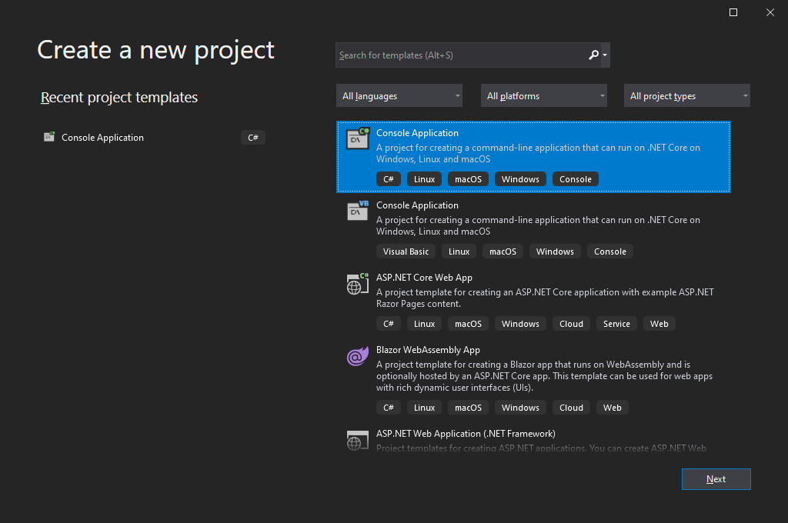

# Getting Started with DeckSurf

This article will tell you how to go from zero to expert with DeckSurf. The idea behind the SDK is to give you direct access to a Stream Deck device that is connected to your computer. If you want to learn more about the inner working of the tooling, refer to [a blog post I put together](https://den.dev/blog/reverse-engineering-stream-deck/) that documents how I reverse engineered the USB protocol.

## Introduction

To get started, start a new .NET 5.0 console application project in Visual Studio. You can bootstrap a project through other means - the internals will be the same.

>[!NOTE]
>The SDK is designed to work with Windows only at this time. Future releases might be updated to support other platforms.

Once the project is bootstrapped, you can add a new package reference by right-clicking on the project in the **Solution Explorer** and selecting the option to **Manage NuGet Packages...**

